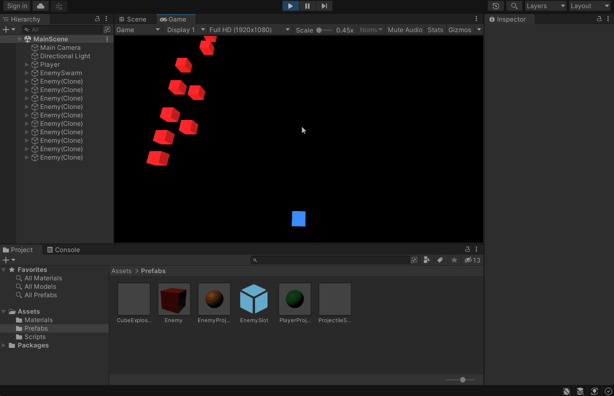

**The University of Melbourne**
# COMP30019 – Graphics and Interaction

## Workshop 10

# Introduction:

In this workshop you will be continuing work on the _Cube Invaders_ game from last time.
The goal will be to create something playable and even somewhat challenging. You'll also
refine the game dynamics and add a bit of polish via much greater use of the Unity physics engine.

  

> **Note** 
> This repository contains the solution from last week. You are welcome to work off this
> as a base, or your own solution from last week. The tasks in this workshop assume
> you understand how everything up until this point works, so it's wise
> to study the solution if you haven't already.

### Tasks:

#### 1. Click to fire

Modify the player controls such that projectiles are fired by clicking the mouse 
rather than pressing space. The projectile should be fired towards the mouse 
click so the player can aim. If you're not sure how to get the mouse position,
remember to check the [relevant Unity docs](https://docs.unity3d.com/ScriptReference/Input.html).

Note that the mouse position is in _pixel coordinates_, but the game is played
in the x-z plane in _world coordinates_. This is where skills learned
in project 1 should come in handy. You’ll need to pick a position in the world 
based on the mouse click, and use the difference between this position and the 
player position to determine the direction for the projectile to move.

> **Note** 
> There's no need to re-invent the wheel here! Unity comes with a `Plane` class that
> can be queried for a ray cast automatically. Check out [this](https://docs.unity3d.com/ScriptReference/Plane.Raycast.html) page
> for a very relevant example if you are stuck.

#### 2. Enemy defenses

Presently, the enemy cube swarm isn't exactly formidable. Your next task is to make enemies
fire projectiles towards the player at random intervals. The firing logic may be
implemented inside the `EnemyController` class. 

Add two serialised fields that allow for tuning of the interval,
namely, a "minimum idle time" and "maximum idle time". Upon enemy creation, 
there should be an initial random delay based on this interval, then indefinite/repeated
firing of a projectile towards the player with more random "idle time" between. This
delay-based approach might be a little messy using just the `Start()` and `Update()`
methods and some private state variables, so perhaps review how the swarm 
is stepped periodically using a coroutine (but you don't _have_ to do it this way).

Make sure the enemy projectiles can actually destroy the player! Give the player
some health like the enemies, and similarly, ensure there's a dramatic explosion
that accompanies the player's demise! Remember to re-use existing game logic where possible. 
For example, there is already a player projectile prefab which could
be copied to create the enemy projectile, and the corresponding `ProjectileController`
component should also be reusable via tuning of the serialised fields. Health
tracking functionality is also very much re-usable.

#### 3. Simple animation: Rotate to aim

Your next task is to rotate both the player and the enemy cubes such that 
they face the current projectile "aim" direction. At this stage
the aim rotation should be re-computed/re-applied _every frame_ for 
both the player and enemies.

We will be updating the aim-look rotation behaviour later on, so you 
may wish to create a separate re-usable component called
`LookRotation` which _for now_ simply wraps Unity's [`Quaternion.LookRotation()`](https://docs.unity3d.com/ScriptReference/Quaternion.LookRotation.html) method
and updates the `Transform` component appropriately.
This should contain a `forward` vector as a serialised field, which is also
updatable by a component that has a reference to it (e.g., a setter method). Ensure
both the `PlayerController` and `EnemyController` classes get respective references
so that the aim rotation can be updated every frame, via this method.

#### 4. More stateful behaviour: Aim first, _then_ fire!

It often helps to think about enemies/NPCs as "state machines" that switch
between a number of discrete states spanning more than one frame. State switches may occur
based on a condition (e.g., player proximity, enemy's health), 
or simply a time interval.
For our enemy cubes, we will call the random interval
between firing projectiles the "idle state". Then, rather than an attack
being instantaneous, a new "attack state" will involve the enemy rotating to face
the player for a second or so before firing a projectile. At this point the enemy
re-enters the idle state, returning to a _neutral_ "forward" aim, and the process repeats.

Your task is to facilitate this aim-first, _then_ fire behaviour. Note that sequencing
enemy attacks like can be useful for more than adding a bit of "polish". It can
also make random elements less frustrating for the player since there's a bit
of notice before a projectile comes flying! 

For an extra challenge, modify the `LookRotation` component from the previous task to 
_interpolate_ rotation such that it rotates towards the target "forward" vector over
a number of frames. The [`Vector3.RotateTowards()`](https://docs.unity3d.com/ScriptReference/Vector3.RotateTowards.html)
method could help here.
This way enemies won't suddenly _snap_ to rotate towards the player when their
state changes from "idle" to "attack".

> **Note** 
> As you've seen,
> coroutines can be useful for facilitating state-switching behaviour. 
> You may also find it helpful to add a private/internal `enum` to the 
> `EnemyController` class that
> maintains the current state, which is _switched_ via a coroutine, but
> accessible within the `Update()` method.
> This is useful if some state-dependent behaviour should occur every frame
> (rather than trying to wedge it into the coroutine sequence, which can
> also be messy in itself).

#### 5. Make things a bit more 21st century (challenge + extension)

Our _Cube Invaders_ game is currently a bit of an odd mix in terms of look and feel. 
The enemy cube
swarm moves like one you'd see in a 70s game arcade, yet is rendered in three-dimensions
using modern lighting/rendering techniques. We also modified the player and enemy cubes to
smoothly rotate and fire, adding to the inconsistent feel. 

We will now commit to a more consistent style, and polish the game dynamics 
accordingly. The game will still be a
homage to space invaders, but with a more modern twist. Before continuing, it might 
be worth having a high-level read of the Unity physics engine documentation for
[three-dimensional projects](https://docs.unity3d.com/Manual/PhysicsOverview.html). Some of these
topics we've already discussed, but not all. Sometimes it is what you don't know is available or
possible out-of-the-box that ends up unnecessarily wasting your time. 

Instead of using colliders as triggers, we will begin by adding `Rigidbody` components 
to the game entities
such that they are controlled by the Unity physics engine. This will require some 
major refactoring of existing components, so we have to do this 
slowly and _repeatedly test_ (see the dot points below for a suggested order).
In particular, you will have to be careful with how objects are moved and controlled.
The `Rigidbody` component takes charge of object transformations and will _compete_ with any
components that directly update the respective object `Transform`. This
can lead to undefined behaviour, so in general, we try to use methods like 
[`AddForce`](https://docs.unity3d.com/ScriptReference/Rigidbody.AddForce.html) and
[`AddTorque`](https://docs.unity3d.com/ScriptReference/Rigidbody.AddTorque.html) to move 
and rotate objects with a `Rigidbody` such that it does the heavy-lifting for us. 
In some cases it's okay to directly change
parameters like position and velocity (e.g., during initialisation of an object), but 
ensure you are conscious of the implications in general. 

As you refactor the game
according to the modifications below, you might need to **temporarily disable** 
game logic that directly modifies `Transform` components until it is appropriately
refactored. 

> **Warning**  
> The Unity physics engine operates in a distinct _fixed_
> update cycle. It's possible to have physics updates zero, one _or more_
> times in-between individual `Update()` calls! You can directly hook into these updates
> using an alternative method called [`FixedUpdate()`](https://docs.unity3d.com/ScriptReference/MonoBehaviour.FixedUpdate.html)
> but be careful -- it's sometimes **unreliable** to check for user input here, since frame-reliant methods like
> `Input.GetKeyDown()` are linked to the ordinary update cycle.

Your (very big) task is to attempt the following modifications:
- Add a `Rigidbody` to the enemy prefab. Instead of the enemy swarm directly arranging
  these prefabs in a grid formation, it should first instantiate _invisible_ "enemy slot" 
  objects in their place. Make these have _kinematic_ rigidbodies 
  and ensure there is no associated collider. 
  Now for the magic ingredient: add a [spring joint](https://docs.unity3d.com/Manual/class-SpringJoint.html)
  on the enemy slot, and connect it to the respective enemy prefab instance. It will take
  some trial and error to get parameters correct, but the end goal is to retain the 
  stepping sequence while smoothing motion in a flexible way. _Tip:_ Try adding some
  drag to the enemy rigidbody to improve stability of the motion. 
- Randomise the `spring` parameter for each slot such that enemies move ever-so-slightly
  out of sync. This should make the swarm movement look a little less artificial.
- Modify how enemies are spawned so that they aren't all instantiated at once, but instead
  progressively with a short interval between. Instantiate them outside of the viewport to 
  make it appear as though they are "flying into place". Because of the newly added spring mechanics,
  the physics engine will take care of smooth movement towards the respective enemy slot.
- We'll next add rigidbodies to projectiles. Before doing this, 
  [create two layers](https://docs.unity3d.com/Manual/Layers.html) to separate
  "enemy objects" and "player objects". Layers can be used in many different contexts,
  but one useful application of them is to prevent physics collisions between sets of
  objects belonging to a "team" (e.g. friendly fire). Configure the [layer collision matrix](https://docs.unity3d.com/Manual/LayerBasedCollision.html) 
  to prevent self-collision of enemy objects and player objects. Ensure the layers
  are appropriately set to player/enemy objects going forward.
- Add a `Rigidbody` to enemy projectiles and utilise [`OnCollisionEnter()`](https://docs.unity3d.com/ScriptReference/Collider.OnCollisionEnter.html) 
  instead of `OnTriggerEnter()` to hook into the physical collision events. Exploit collision 
  [contact data](https://docs.unity3d.com/ScriptReference/Collision-contacts.html) passed 
  to this method to orient particle effects in the direction of the first hit-point normal.
  Verify that the projectiles visibly displace enemy cubes when they are hit but not
  destroyed. (The spring joint should then quickly move them back into place.)
- Now do the same for player projectiles. In theory, this shouldn't be much work if
  re-usable component design has been employed up until this point.
- Finally, add a `Rigidbody` to the player cube. Responsive movement without directly
  modifying the transform will be the challenge here. You can try applying a force
  in response to user input, but it might also make sense to adopt a similar strategy to
  enemy movement via a spring joint (move a kinematic target based on user input, and
  have the player cube follow via the joint).
- Refactor the `LookDirection` component into a `RigidbodyLookDirection` component
  that applies torque to a cube to rotate it. You'll
  need to take care to reduce the torque as the rotation gets closer to the target.
- Add a bit more polish to the enemy attack sequence. At the moment the enemies fire
  projectiles _through_ other enemies, due to the use of layering. This works, but
  looks a bit strange. To fix it, make enemies "lunge" or "jump" upwards before quickly
  firing at the player. Remember that their motion is constrained by the spring joint,
  so simply applying an upwards force should be sufficient to control the motion. The tricky
  bit is detecting when they've reached the peak of their motion (the crude fix is to
  just add a delay, but try to do this properly for an extra challenge).
- You may have noticed physics-engine controlled motion sometimes looks a little jittery. 
  This is likely due to the separate fixed update loop being out of sync with the render update loop. 
  This is quite a hard problem to address perfectly, but there are techniques. One of
  the simplest is to turn on "interpolation" for rigidbody components where the issue
  is visible. Have a read of [this summary](https://blog.terresquall.com/2020/08/unity-rigidbodys-interpolate-property/)
  of the problem, which also shows how to solve it using this technique (and discusses respective
  pitfalls). Try experimenting with interpolation and/or extrapolation for the various 
  rigidbodies you've created.

It's unlikely you'll complete all of these modifications
during the workshop, so continue to work on them over the next week, and of course,
check out the sample solution when it is made available. Next time, 
we'll round off the gameplay elements workshops by adding some user interfaces!
